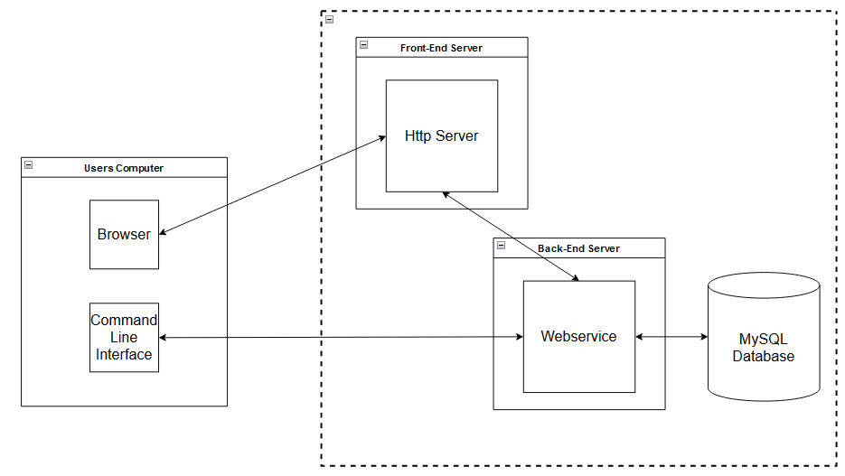

# Janus Version Control System
##  Project Vision
The Janus Version Control System is a solution designed to assist developers, project managers and organisations who need a secure, customizable and scalable tool to manage different versions of their projects, on one or more devices.

Janus combines a Command Line Interface (CLI) for local version control, with a Dockerised web application for remote access to their projects, allowing users to manage, commit and push their changes from one device to be stored remotely and access them from any other device.

Unlike cloud systems like github, Janus will be run completely on Docker and can thus be deployed internally within organisations. This internal deployment offers enhanced security, as sensitive data about the project remains within the company’s control, which can ensure that the organisations security regulations are maintained. The use of Docker also means that the Janus system can be scaled both horizontally and vertically, letting the system grow to suit the size and complexity of the users’ projects.

In addition, the Janus CLI is designed to be customisable allowing organisations to enhance the system to suit their needs. By utilising the ability to add plugins to the CLI, Janus can be used and adapted to meet many more unique issues or requirements the users might have, overall improving their efficiency in development their projects.

The security, customisation and scalability provide a great solution for organisations and teams who want more control over their version control system and development of their projects.

## Core Features

#### Command Line Interface (CLI)
-	**Repository Initialisation:** Users can initialize a local repository. Which will create a hidden .janus folder for version control.
-	**File Staging:** The CLI allows users to stage files to be ready for the next commit (janus add).
-	**Committing Changes:** The user commits their changes to their local repository with a message. This creates a version of the project.
-	**Commit History:** The user can view all their previous project versions.
-	**Revert to Previous Commit:** Projects can be reverted to previous versions.
-	**Merge Conflict Resolution:** In case conflicts occur between changes the related files will be shown and the conflict can be resolved.
-	**Pushing changes to remote repository:** Users can push their local repository to the remote repository.
-	**Remote access:** The users can fetch their project from the remote repository from any device.

#### Web Application
-	**User Authentication & Authorisation:** Secure login and access control to repository.
-	**Repository Dashboard:** The users can view all repositories they have access to.
-	**View Commit History:** There is a display to see the commit history for each repository.
-	**Download Specific Versions:** Each version of the project can be downloaded from a specific commit.
-	**Repository Management:** Repository owners can manage the access of other users and change the repositories visibility.
-	**Multi Device Design:** The web app works and displays correctly on many different devices.

#### Dockerised Infrastructure
-	**Dockerised Frontend, Backend & Database:** All parts of the product are split into microservices and run on Docker.
-	**Horizontal and Vertical Scalability:** Docker containers allow for the system to scale both horizontally and vertically.
-	**Consistent Environments:** Running on Docker ensures that the Janus product can run in different environments.

#### Backend server
-	**API for CLI and Web App:** The backend utilises APIs to allow the CLI, web app and database to communicate with each other.

#### Database (MySQL)
-	**Secure Data Storage:** All data is encrypted to protect sensitive data.
-	**Data Backup & Recovery:** Data is backed up regularly to prevent data loss and can be restored easily.
-	**Version Control Storage:** The backend manages the storage of data into the MySQL database.

#### Security
-	**Data Encryption:** All data transfers are encrypted to prevent unauthorized access.
-	**Access Control:** The repository owners can manage who can access the repository.
-	**Security Policies Compliance:** The Janus system can be deployed internally within organisations. This ensures data is kept within their control, following security procedures and reducing the risk of data breaches.

#### Customisability
-	**Plugin System for CLI:** Plugins can easily be added to the CLI to allow organisations to add their own functionality to suit their specific needs.

## Technologies & Component Architecture
### Command Line Interface (CLI)
**Framework:** ***.NET Core***

**Language:** ***C#***

The CLI will be built using .NET Core and written in **C#.

I chose this as .NET Core is an excellent framework to use for cross platform development, working well on Windows, Linux and MacOS. C# was chosen as it is high performance language with simple I/O file operations, which is necessary for the CLI version control.

### Backend
**Framework:** ***ASP.NET Core***

**Language:** ***C#***

**Authentication:** ***JSON Web Tokens (JWT)***

**Database Interaction:** ***Entity Framework Core (EFC)***

The backend will utilise a ASP.NET Core framework to handle the communication between CLI, web app and the database using web APIs. JSON Web Tokens (JWT) will be used to authenticate and authorise users/actions. While the database management will use Entity Framework Core (EFC) to interact with the database. All of these will be written in C#.

ASP.NET Core is a scalable, secure and high performing framework making it well suited for the backend APIs. EFC is an object-relational mapper (ORM) that allows the backend to easily interact with the database using C# objects, without having to use SQL queries. This simplifies the interaction between the backend and the database.

### Database

**Database:** ***MySQL***

**Object-Relational Mapper (ORM):** ***Entity Framework Core (EFC)***

MySQL will be used for the database and mentioned previously, Entity Framework Core will be used so that the backend can easily interact with the database.

MySQL is a scalable and well performing relational database which interacts well with the .NET backend. Additionally, MySQL supports transactions for commits, pushes and rollbacks. Transactions are critical as they ensure that data consistency is maintained.

Web Application
Web Page Layout: HTML
Web Page Styling: CSS
Dynamic Page Elements: React (JavaScript)

The frontend web application will be developed using HTML, CSS and React with JavaScript.

React was chosen as it integrates well with the JWT and the backend APIs, while also having a wide selection of libraries and tools available for use. The component-based architecture allows for a modular design that makes development easier and improves scalability. 

Deployment
System Deployment: Docker Containers

The CLI will use the .NET installer and to be used has to be installed locally on the user’s machine. The web app, backend and database however will be on Docker containers.

Docker ensures that the system can run in many environments and enable easy scaling.

Above is a diagram showing how each part of the system interacts with each other. The dashed line representing Docker with each part inside being run in a container.
